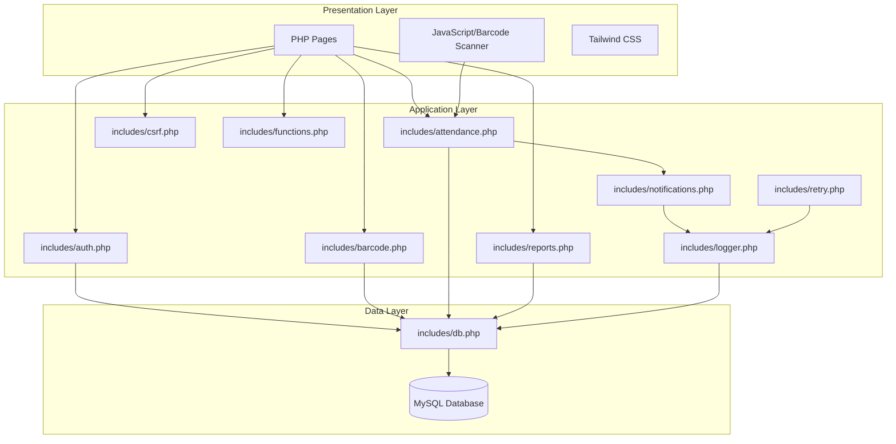
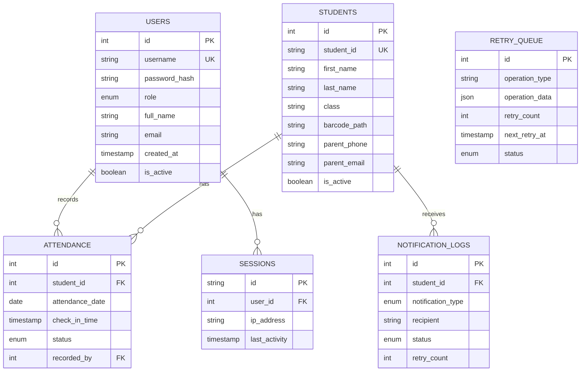

# Design Document

## Overview

The Barcode Attendance System is a web-based application built with PHP 8.x, MySQL 8.0, and Tailwind CSS 3.x. The system follows a procedural PHP architecture with clear separation between business logic (includes/), presentation (pages/), and data storage (database/). The design emphasizes security, scalability, and maintainability through the use of prepared statements, CSRF protection, role-based access control, and a modular folder structure.

The color scheme follows the provided palette: primary purple/violet (#8B5CF6), accent orange (#F59E0B), with gray neutrals for text and backgrounds. The system supports both hardware barcode scanners (keyboard wedge input) and camera-based scanning using JavaScript libraries.

## Architecture

### High-Level Architecture

The system follows a three-tier architecture:

1. **Presentation Layer**: PHP pages with embedded HTML, Tailwind CSS styling and JavaScript for interactivity
2. **Application Layer**: PHP includes files handling business logic, validation, and orchestration
3. **Data Layer**: MySQL database with PDO connection providing data access through prepared statements

### Component Diagram



### Request Flow

1. User requests a page (e.g., `pages/students.php`)
2. Page includes necessary files (auth.php, db.php, functions.php)
3. Session validation checks authentication status
4. CSRF token validation (for POST requests)
5. Page logic processes request, calls functions from includes/
6. Functions execute database queries using prepared statements via db.php
7. Page renders HTML with Tailwind CSS styling
8. Response sent to user

## Components and Interfaces

### Core Components

#### 1. Configuration (`config/config.php`)

**Purpose**: Centralized configuration management

**Functions**:
```php
// Load environment-specific configuration
// Returns associative array with all config values
function loadConfig(string $environment = 'production'): array

// Global $config array accessible throughout application
```

**Responsibilities**:
- Load environment-specific configuration
- Provide access to database credentials, API keys, paths
- Store configuration outside web root for security

#### 2. Database Connection (`includes/db.php`)

**Purpose**: Database connection and query execution

**Functions**:
```php
// Get PDO database connection
function getDbConnection(): PDO

// Execute prepared statement with parameters
function dbQuery(string $sql, array $params = []): PDOStatement

// Execute and fetch single row
function dbFetchOne(string $sql, array $params = []): ?array

// Execute and fetch all rows
function dbFetchAll(string $sql, array $params = []): array
```

**Responsibilities**:
- Establish and maintain database connection
- Provide PDO instance for prepared statements
- Handle connection errors gracefully

#### 3. Authentication (`includes/auth.php`)

**Purpose**: Handle user authentication and authorization

**Functions**:
```php
// Attempt login with credentials
function login(string $username, string $password): bool

// Logout current user
function logout(): void

// Check if user is authenticated
function isLoggedIn(): bool

// Get current user data
function getCurrentUser(): ?array

// Check if user has specific role
function hasRole(string $role): bool

// Require authentication (redirect if not logged in)
function requireAuth(): void

// Require specific role (redirect if insufficient permissions)
function requireRole(string $role): void
```

**Responsibilities**:
- Validate credentials using password_verify()
- Manage secure sessions
- Check user roles and permissions
- Protect against session fixation

#### 4. CSRF Protection (`includes/csrf.php`)

**Purpose**: Generate and validate CSRF tokens

**Functions**:
```php
// Generate CSRF token for session
function generateCsrfToken(): string

// Validate CSRF token from request
function validateCsrfToken(string $token): bool

// Get HTML input field for forms
function csrfField(): string

// Verify CSRF token or die with error
function verifyCsrf(): void
```

**Responsibilities**:
- Generate unique tokens per session
- Validate tokens on form submission
- Provide HTML input field for forms

#### 5. Validation and Sanitization (`includes/functions.php`)

**Purpose**: Input validation and sanitization helpers

**Functions**:
```php
// Sanitize string input
function sanitizeString(string $input): string

// Sanitize email
function sanitizeEmail(string $email): string

// Validate email format
function validateEmail(string $email): bool

// Validate phone number
function validatePhone(string $phone): bool

// Validate required fields
function validateRequired(array $fields, array $data): array

// Escape output for HTML
function e(string $string): string

// Redirect helper
function redirect(string $url): void

// Flash message helpers
function setFlash(string $type, string $message): void
function getFlash(): ?array
```

**Responsibilities**:
- Sanitize user input
- Validate data formats
- Provide utility functions for common tasks

#### 6. Barcode Generation (`includes/barcode.php`)

**Purpose**: Generate barcode images

**Functions**:
```php
// Generate barcode image and save to file
function generateBarcode(string $data, string $filename): string

// Get barcode image path for student
function getBarcodePath(string $studentId): string
```

**Responsibilities**:
- Generate barcode images using picqer library
- Support CODE128 format
- Save images to storage/barcodes/ directory
- Return file path for database storage

#### 7. Attendance Management (`includes/attendance.php`)

**Purpose**: Attendance record management

**Functions**:
```php
// Record attendance for student
function recordAttendance(int $studentId, string $status = 'present'): bool

// Check if student already scanned today
function hasAttendanceToday(int $studentId): bool

// Get attendance records by date
function getAttendanceByDate(string $date): array

// Get attendance records for student in date range
function getStudentAttendance(int $studentId, string $startDate, string $endDate): array

// Get attendance statistics
function getAttendanceStats(string $startDate, string $endDate): array

// Find student by barcode
function findStudentByBarcode(string $barcode): ?array
```

**Responsibilities**:
- Record attendance with timestamps
- Query attendance by date, student, or range
- Calculate attendance statistics
- Prevent duplicate entries for same day

#### 8. Notifications (`includes/notifications.php`)

**Purpose**: Send parent notifications

**Functions**:
```php
// Send notification to parent
function sendNotification(int $studentId, string $message): bool

// Send email notification
function sendEmailNotification(string $email, string $subject, string $message): bool

// Send SMS notification
function sendSmsNotification(string $phone, string $message): bool

// Queue notification for retry
function queueNotification(int $studentId, string $type, string $recipient, string $message): void

// Format attendance notification message
function formatAttendanceMessage(array $student, string $status, string $timestamp): string
```

**Responsibilities**:
- Send SMS/email notifications to parents
- Integrate with PHPMailer and Twilio
- Queue failed notifications for retry
- Log notification attempts

#### 9. Retry System (`includes/retry.php`)

**Purpose**: Handle failed operation retries

**Functions**:
```php
// Add operation to retry queue
function addToRetryQueue(string $operation, array $data, int $maxRetries = 3): void

// Process retry queue (called by cron)
function processRetryQueue(): void

// Mark retry as completed
function markRetryCompleted(int $queueId): void

// Mark retry as failed
function markRetryFailed(int $queueId, string $error): void

// Calculate next retry time with exponential backoff
function calculateNextRetry(int $retryCount): string
```

**Responsibilities**:
- Queue failed operations
- Implement exponential backoff
- Retry operations on schedule
- Mark permanent failures after max attempts

#### 10. Logging (`includes/logger.php`)

**Purpose**: System logging

**Functions**:
```php
// Log message to database
function logMessage(string $level, string $message, array $context = []): void

// Log info message
function logInfo(string $message, array $context = []): void

// Log warning message
function logWarning(string $message, array $context = []): void

// Log error message
function logError(string $message, array $context = []): void

// Log critical message
function logCritical(string $message, array $context = []): void

// Get recent logs
function getRecentLogs(int $limit = 100, string $level = null): array
```

**Responsibilities**:
- Log system events to database
- Support different log levels
- Store context information

#### 11. Report Generation (`includes/reports.php`)

**Purpose**: Generate and export attendance reports

**Functions**:
```php
// Generate report data with filters
function generateReport(array $filters): array

// Calculate report statistics
function calculateReportStats(array $data): array

// Export report to CSV
function exportToCsv(array $data, string $filename): string

// Export report to PDF
function exportToPdf(array $data, string $filename): string

// Export report to Excel
function exportToExcel(array $data, string $filename): string
```

**Responsibilities**:
- Filter and aggregate attendance data
- Calculate statistics (present, absent, percentage)
- Export to CSV, PDF, Excel formats
- Generate downloadable files

## Data Models

### Database Schema

```sql
-- Users table for authentication
CREATE TABLE users (
    id INT PRIMARY KEY AUTO_INCREMENT,
    username VARCHAR(50) UNIQUE NOT NULL,
    password_hash VARCHAR(255) NOT NULL,
    role ENUM('admin', 'operator', 'viewer') NOT NULL DEFAULT 'viewer',
    full_name VARCHAR(100) NOT NULL,
    email VARCHAR(100),
    created_at TIMESTAMP DEFAULT CURRENT_TIMESTAMP,
    updated_at TIMESTAMP DEFAULT CURRENT_TIMESTAMP ON UPDATE CURRENT_TIMESTAMP,
    last_login TIMESTAMP NULL,
    is_active BOOLEAN DEFAULT TRUE,
    INDEX idx_username (username),
    INDEX idx_role (role)
) ENGINE=InnoDB DEFAULT CHARSET=utf8mb4 COLLATE=utf8mb4_unicode_ci;

-- Students table
CREATE TABLE students (
    id INT PRIMARY KEY AUTO_INCREMENT,
    student_id VARCHAR(20) UNIQUE NOT NULL,
    first_name VARCHAR(50) NOT NULL,
    last_name VARCHAR(50) NOT NULL,
    class VARCHAR(20),
    section VARCHAR(10),
    barcode_path VARCHAR(255),
    parent_name VARCHAR(100),
    parent_phone VARCHAR(20),
    parent_email VARCHAR(100),
    address TEXT,
    date_of_birth DATE,
    created_at TIMESTAMP DEFAULT CURRENT_TIMESTAMP,
    updated_at TIMESTAMP DEFAULT CURRENT_TIMESTAMP ON UPDATE CURRENT_TIMESTAMP,
    is_active BOOLEAN DEFAULT TRUE,
    INDEX idx_student_id (student_id),
    INDEX idx_class_section (class, section),
    INDEX idx_name (last_name, first_name)
) ENGINE=InnoDB DEFAULT CHARSET=utf8mb4 COLLATE=utf8mb4_unicode_ci;

-- Attendance records table
CREATE TABLE attendance (
    id INT PRIMARY KEY AUTO_INCREMENT,
    student_id INT NOT NULL,
    attendance_date DATE NOT NULL,
    check_in_time TIMESTAMP DEFAULT CURRENT_TIMESTAMP,
    status ENUM('present', 'late', 'absent') DEFAULT 'present',
    recorded_by INT,
    notes TEXT,
    FOREIGN KEY (student_id) REFERENCES students(id) ON DELETE CASCADE,
    FOREIGN KEY (recorded_by) REFERENCES users(id) ON DELETE SET NULL,
    UNIQUE KEY unique_attendance (student_id, attendance_date),
    INDEX idx_date (attendance_date),
    INDEX idx_student_date (student_id, attendance_date),
    INDEX idx_status (status)
) ENGINE=InnoDB DEFAULT CHARSET=utf8mb4 COLLATE=utf8mb4_unicode_ci;

-- Notification logs table
CREATE TABLE notification_logs (
    id INT PRIMARY KEY AUTO_INCREMENT,
    student_id INT NOT NULL,
    notification_type ENUM('sms', 'email') NOT NULL,
    recipient VARCHAR(100) NOT NULL,
    message TEXT NOT NULL,
    status ENUM('pending', 'sent', 'failed') DEFAULT 'pending',
    sent_at TIMESTAMP NULL,
    error_message TEXT,
    retry_count INT DEFAULT 0,
    created_at TIMESTAMP DEFAULT CURRENT_TIMESTAMP,
    FOREIGN KEY (student_id) REFERENCES students(id) ON DELETE CASCADE,
    INDEX idx_status (status),
    INDEX idx_student (student_id),
    INDEX idx_created (created_at)
) ENGINE=InnoDB DEFAULT CHARSET=utf8mb4 COLLATE=utf8mb4_unicode_ci;

-- Retry queue table
CREATE TABLE retry_queue (
    id INT PRIMARY KEY AUTO_INCREMENT,
    operation_type VARCHAR(50) NOT NULL,
    operation_data JSON NOT NULL,
    retry_count INT DEFAULT 0,
    max_retries INT DEFAULT 3,
    next_retry_at TIMESTAMP NULL,
    status ENUM('pending', 'processing', 'completed', 'failed') DEFAULT 'pending',
    error_message TEXT,
    created_at TIMESTAMP DEFAULT CURRENT_TIMESTAMP,
    updated_at TIMESTAMP DEFAULT CURRENT_TIMESTAMP ON UPDATE CURRENT_TIMESTAMP,
    INDEX idx_status_retry (status, next_retry_at),
    INDEX idx_operation (operation_type)
) ENGINE=InnoDB DEFAULT CHARSET=utf8mb4 COLLATE=utf8mb4_unicode_ci;

-- System logs table
CREATE TABLE system_logs (
    id INT PRIMARY KEY AUTO_INCREMENT,
    log_level ENUM('info', 'warning', 'error', 'critical') NOT NULL,
    message TEXT NOT NULL,
    context JSON,
    user_id INT,
    ip_address VARCHAR(45),
    user_agent TEXT,
    created_at TIMESTAMP DEFAULT CURRENT_TIMESTAMP,
    FOREIGN KEY (user_id) REFERENCES users(id) ON DELETE SET NULL,
    INDEX idx_level_date (log_level, created_at),
    INDEX idx_user (user_id)
) ENGINE=InnoDB DEFAULT CHARSET=utf8mb4 COLLATE=utf8mb4_unicode_ci;

-- Sessions table for secure session management
CREATE TABLE sessions (
    id VARCHAR(128) PRIMARY KEY,
    user_id INT NOT NULL,
    ip_address VARCHAR(45),
    user_agent TEXT,
    last_activity TIMESTAMP DEFAULT CURRENT_TIMESTAMP ON UPDATE CURRENT_TIMESTAMP,
    created_at TIMESTAMP DEFAULT CURRENT_TIMESTAMP,
    FOREIGN KEY (user_id) REFERENCES users(id) ON DELETE CASCADE,
    INDEX idx_user (user_id),
    INDEX idx_activity (last_activity)
) ENGINE=InnoDB DEFAULT CHARSET=utf8mb4 COLLATE=utf8mb4_unicode_ci;
```

### Entity Relationships



## Cor
rectness Properties

*A property is a characteristic or behavior that should hold true across all valid executions of a system-essentially, a formal statement about what the system should do. Properties serve as the bridge between human-readable specifications and machine-verifiable correctness guarantees.*

### Authentication and Authorization Properties

**Property 1: Credential validation consistency**
*For any* valid username and password pair stored in the database, the authentication system should successfully validate those credentials and grant access.
**Validates: Requirements 1.1**

**Property 2: Session creation with role information**
*For any* successful authentication, the system should create a session that contains the user's role information.
**Validates: Requirements 1.2**

**Property 3: Unauthenticated access redirection**
*For any* restricted page request without valid authentication, the system should redirect to the login page.
**Validates: Requirements 1.3**

**Property 4: Role-based access control**
*For any* action requiring a specific role, users without that role should be denied access with an authorization error.
**Validates: Requirements 1.4**

**Property 5: Session validation on requests**
*For any* page request with a valid session, the system should validate session integrity; for any invalid or tampered session, access should be denied.
**Validates: Requirements 1.5**

### Student Management Properties

**Property 6: Student creation with unique identifier**
*For any* valid student data submitted, the system should create a student record with a unique identifier that doesn't conflict with existing students.
**Validates: Requirements 2.1**

**Property 7: Barcode generation for students**
*For any* created student record, a barcode image should be generated that encodes the student's unique identifier.
**Validates: Requirements 2.2**

**Property 8: Barcode path storage**
*For any* student with a generated barcode, the database record should contain the correct path to the barcode image file.
**Validates: Requirements 2.3**

**Property 9: Student record display completeness**
*For any* student record view, the displayed information should include both student data and the associated barcode image.
**Validates: Requirements 2.4**

**Property 10: Duplicate student ID rejection**
*For any* attempt to create a student with an existing student_id, the system should reject the creation and return a validation error.
**Validates: Requirements 2.5**

### Attendance Scanning Properties

**Property 11: Barcode student identification**
*For any* valid student barcode scanned (via hardware or camera), the system should correctly identify the corresponding student.
**Validates: Requirements 3.1, 3.2**

**Property 12: Attendance record creation**
*For any* valid student barcode scan, an attendance log entry should be created with the current timestamp and correct student identifier.
**Validates: Requirements 3.3**

**Property 13: Invalid barcode rejection**
*For any* barcode that doesn't match an existing student, the system should display an error and prevent attendance recording.
**Validates: Requirements 3.4**

**Property 14: Scan success feedback**
*For any* successful attendance scan, the system response should include visual confirmation indicators.
**Validates: Requirements 3.5**

### Notification Properties

**Property 15: Parent contact retrieval**
*For any* attendance record creation, the system should retrieve the associated student's parent contact information.
**Validates: Requirements 4.1**

**Property 16: Notification content completeness**
*For any* notification sent, the message should contain the student name, timestamp, and attendance status.
**Validates: Requirements 4.2**

**Property 17: Failed notification queuing**
*For any* notification that fails to send, the system should create a log entry and add the notification to the retry queue.
**Validates: Requirements 4.3**

**Property 18: Retry queue processing**
*For any* queued notification that has reached its retry time, the retry processor should attempt to resend it.
**Validates: Requirements 4.4**

**Property 19: Successful notification logging**
*For any* successfully sent notification, the notification log should be updated with delivery confirmation.
**Validates: Requirements 4.5**

### Logging and Retry Properties

**Property 20: Critical failure logging**
*For any* critical operation that fails, a log entry should be created containing timestamp, error details, and operation context.
**Validates: Requirements 5.1**

**Property 21: Retry queue addition**
*For any* retryable operation that fails, the operation should be added to the retry queue with retry count and next attempt timestamp.
**Validates: Requirements 5.2**

**Property 22: Retry processor execution**
*For any* retry processor run, all queued operations whose retry time has arrived should be attempted.
**Validates: Requirements 5.3**

**Property 23: Successful retry cleanup**
*For any* retry attempt that succeeds, the operation should be removed from the retry queue and success should be logged.
**Validates: Requirements 5.4**

**Property 24: Maximum retry handling**
*For any* operation that reaches maximum retry attempts, it should be marked as permanently failed and trigger administrator notification.
**Validates: Requirements 5.5**

### Reporting Properties

**Property 25: Report filtering accuracy**
*For any* set of filter criteria (date range, student), the retrieved attendance records should match exactly those criteria.
**Validates: Requirements 6.1**

**Property 26: Statistics calculation correctness**
*For any* set of attendance data, the calculated statistics (present count, absent count, percentage) should be mathematically accurate.
**Validates: Requirements 6.2**

**Property 27: Export format generation**
*For any* valid export format selection (CSV, PDF, Excel), the system should generate output in that specific format.
**Validates: Requirements 6.3**

**Property 28: Report content completeness**
*For any* generated report, it should include student names, identifiers, dates, timestamps, and calculated statistics.
**Validates: Requirements 6.4**

**Property 29: Export file availability**
*For any* completed export operation, a downloadable file should be available to the administrator.
**Validates: Requirements 6.5**

### Dashboard Properties

**Property 30: Dashboard statistics display**
*For any* dashboard access, the response should include total student count, present count, absent count, and attendance percentage for the current day.
**Validates: Requirements 7.1**

**Property 31: Academic period aggregation**
*For any* dashboard statistics calculation, the data should be aggregated from the current academic period only.
**Validates: Requirements 7.2**

**Property 32: Dashboard chart data presence**
*For any* dashboard load, the response should include chart data showing attendance trends.
**Validates: Requirements 7.3**

**Property 33: Role-based data filtering**
*For any* user role, the dashboard should display only statistics and data that the role is authorized to access.
**Validates: Requirements 7.4**

### Configuration Properties

**Property 34: Configuration loading on initialization**
*For any* system initialization, configuration variables should be loaded from the centralized configuration file.
**Validates: Requirements 8.1**

**Property 35: Configuration accessibility**
*For any* application component, configuration values (database credentials, API keys, parameters) should be accessible after loading.
**Validates: Requirements 8.2**

**Property 36: Configuration caching**
*For any* configuration value, multiple accesses should return the value without re-reading the file.
**Validates: Requirements 8.3**

**Property 37: Environment-specific configuration**
*For any* environment (development, staging, production), the system should load the appropriate configuration file.
**Validates: Requirements 8.5**

### Security Properties

**Property 38: CSRF token validation**
*For any* form submission (POST request), the system should validate the presence and correctness of the CSRF token.
**Validates: Requirements 9.1**

**Property 39: Input validation and sanitization**
*For any* user input received, the system should validate and sanitize the data according to expected data types and formats.
**Validates: Requirements 9.3**

**Property 40: Password hashing**
*For any* password stored in the database, it should be hashed using a secure algorithm and not stored in plaintext.
**Validates: Requirements 9.4**

**Property 41: Foreign key constraint enforcement**
*For any* attempt to violate referential integrity (e.g., deleting a referenced record), the database should enforce foreign key constraints and prevent the violation.
**Validates: Requirements 10.3**

## Error Handling

### Error Categories

1. **Authentication Errors**
   - Invalid credentials
   - Expired sessions
   - Insufficient permissions
   - CSRF token mismatch

2. **Validation Errors**
   - Missing required fields
   - Invalid data formats
   - Duplicate entries
   - Constraint violations

3. **Barcode Scanning Errors**
   - Unrecognized barcode
   - Invalid barcode format
   - Camera access denied
   - Duplicate scan (same day)

4. **Notification Errors**
   - API connection failure
   - Invalid recipient
   - Rate limiting
   - Timeout

5. **Database Errors**
   - Connection failure
   - Query execution failure
   - Constraint violation
   - Deadlock

### Error Handling Strategy

**Graceful Degradation**:
- Display user-friendly error messages
- Log technical details for debugging
- Maintain system stability during errors
- Provide recovery options where possible

**Error Response Format**:
```php
[
    'success' => false,
    'error' => [
        'code' => 'ERROR_CODE',
        'message' => 'User-friendly message',
        'field' => 'field_name' // for validation errors
    ]
]
```

**Retry Logic**:
- Implement exponential backoff for retryable operations
- Maximum 3 retry attempts for notifications
- Queue failed operations for background processing
- Alert administrators for permanent failures

**Logging**:
- Log all errors with context (user, IP, timestamp)
- Use appropriate log levels (info, warning, error, critical)
- Store logs in database for querying and analysis
- Implement log rotation for disk space management

## Testing Strategy

### Unit Testing

The system will use PHPUnit for unit testing. Unit tests will cover:

**Authentication and Authorization** (includes/auth.php):
- Password hashing and verification
- Session creation and validation
- Role-based access control logic

**CSRF Protection** (includes/csrf.php):
- CSRF token generation and validation

**Student Management** (includes/functions.php, pages/student-*.php):
- Student creation with validation
- Duplicate detection
- Barcode path storage

**Attendance Recording** (includes/attendance.php):
- Attendance log creation
- Duplicate prevention (same student, same day)
- Timestamp accuracy
- Barcode student lookup

**Notification System** (includes/notifications.php):
- Message formatting
- Email/SMS sending
- Queue management

**Retry System** (includes/retry.php):
- Queue management
- Exponential backoff calculation
- Retry logic

**Report Generation** (includes/reports.php, includes/export-*.php):
- Statistics calculation
- Date range filtering
- Export format generation (CSV, PDF, Excel)

### Property-Based Testing

The system will use **Pest PHP** with the **Pest Property Testing Plugin** for property-based testing. Each property-based test will run a minimum of 100 iterations with randomly generated inputs.

**Property Test Tagging Convention**:
Each property-based test must include a comment tag in this exact format:
```php
// Feature: barcode-attendance-system, Property X: [property description]
```

**Key Property Tests**:

1. **Authentication Properties** (Properties 1-5):
   - Generate random valid credentials, verify authentication succeeds
   - Generate random invalid credentials, verify authentication fails
   - Test session validation with valid and tampered sessions
   - Test role-based access with various role combinations

2. **Student Management Properties** (Properties 6-10):
   - Generate random student data, verify unique ID assignment
   - Test barcode generation for various student IDs
   - Test duplicate detection with existing student IDs

3. **Attendance Scanning Properties** (Properties 11-14):
   - Generate random valid barcodes, verify student identification
   - Generate random invalid barcodes, verify rejection
   - Test attendance record creation with various timestamps

4. **Notification Properties** (Properties 15-19):
   - Test notification content with random student data
   - Simulate send failures, verify queuing behavior
   - Test retry logic with various failure scenarios

5. **Reporting Properties** (Properties 25-29):
   - Generate random attendance data, verify statistics accuracy
   - Test filtering with various date ranges and criteria
   - Verify report completeness with random datasets

6. **Security Properties** (Properties 38-41):
   - Test CSRF validation with valid and invalid tokens
   - Test input validation with various malformed inputs
   - Verify password hashing for random passwords

**Test Configuration**:
```php
// pest.php
uses(Tests\TestCase::class)->in('Feature');

// Configure property testing
pest()->property()->iterations(100);
```

### Integration Testing

Integration tests will verify:
- End-to-end attendance recording flow
- Notification sending with actual API (test mode)
- Report generation and export
- Database transaction handling
- Session management across requests

### Security Testing

Security tests will verify:
- SQL injection prevention (prepared statements)
- XSS prevention (output escaping)
- CSRF protection on all forms
- Password strength requirements
- Session hijacking prevention

## Folder Structure

```
attendance-system/
├── config/
│   ├── config.php              # Main configuration
│   ├── config.dev.php          # Development config
│   └── config.prod.php         # Production config
├── includes/
│   ├── db.php                  # Database connection
│   ├── auth.php                # Authentication functions
│   ├── csrf.php                # CSRF protection
│   ├── functions.php           # Validation and utility functions
│   ├── barcode.php             # Barcode generation
│   ├── attendance.php          # Attendance management
│   ├── notifications.php       # Notification sending
│   ├── retry.php               # Retry system
│   ├── logger.php              # Logging functions
│   ├── reports.php             # Report generation
│   ├── export-csv.php          # CSV export
│   ├── export-pdf.php          # PDF export
│   ├── export-excel.php        # Excel export
│   ├── header.php              # Common header
│   ├── footer.php              # Common footer
│   └── sidebar.php             # Navigation sidebar
├── pages/
│   ├── login.php               # Login page
│   ├── dashboard.php           # Dashboard
│   ├── students.php            # Student list
│   ├── student-add.php         # Add student
│   ├── student-edit.php        # Edit student
│   ├── student-view.php        # View student
│   ├── scan.php                # Barcode scanning
│   ├── attendance-history.php  # Attendance history
│   ├── reports.php             # Reports page
│   └── logs.php                # System logs (admin only)
├── assets/
│   ├── css/
│   │   └── app.css             # Tailwind CSS
│   ├── js/
│   │   ├── scanner.js          # Barcode scanning
│   │   ├── charts.js           # Chart rendering
│   │   └── app.js              # General JS
│   └── images/
│       └── logo.png
├── storage/
│   ├── barcodes/               # Generated barcodes
│   └── exports/                # Exported reports
├── database/
│   ├── schema.sql              # Database schema
│   └── seeds.sql               # Sample data (optional)
├── cron/
│   └── process-retries.php     # Retry processor script
├── tests/
│   ├── Unit/                   # Unit tests
│   ├── Feature/                # Integration tests
│   └── Property/               # Property-based tests
├── vendor/                     # Composer dependencies
├── index.php                   # Entry point
├── .htaccess                   # Apache configuration
├── .env                        # Environment variables
├── .env.example                # Environment template
├── composer.json               # PHP dependencies
├── tailwind.config.js          # Tailwind configuration
└── README.md                   # Documentation
```

## Technology Stack

### Backend
- **PHP 8.1+**: Core language
- **MySQL 8.0+**: Database
- **PDO**: Database abstraction
- **Composer**: Dependency management

### Frontend
- **Tailwind CSS 3.x**: Styling framework
- **Alpine.js**: Lightweight JavaScript framework
- **Chart.js**: Data visualization
- **QuaggaJS**: Barcode scanning library

### Libraries
- **picqer/php-barcode-generator**: Barcode generation
- **PHPMailer**: Email notifications
- **Twilio SDK**: SMS notifications
- **TCPDF** or **mPDF**: PDF generation
- **PhpSpreadsheet**: Excel export
- **PHPUnit**: Unit testing
- **Pest PHP**: Property-based testing

### Security
- **password_hash()**: Password hashing (bcrypt)
- **PDO prepared statements**: SQL injection prevention
- **htmlspecialchars()**: XSS prevention
- **CSRF tokens**: CSRF protection
- **HTTPS**: Transport security

## Deployment Considerations

### Server Requirements
- PHP 8.1 or higher
- MySQL 8.0 or higher
- Apache/Nginx web server
- SSL certificate for HTTPS
- Composer installed
- Node.js (for Tailwind CSS build)

### Performance Optimization
- Database indexing on frequently queried columns
- Query result caching for dashboard statistics
- Lazy loading for student lists
- Image optimization for barcodes
- CDN for static assets (optional)

### Scalability
- Database connection pooling
- Horizontal scaling with load balancer
- Session storage in Redis (for multi-server)
- Background job processing for notifications
- Database replication for read-heavy operations

### Monitoring
- Application error logging
- Database query performance monitoring
- Notification delivery tracking
- User activity logging
- System health checks

### Backup Strategy
- Daily automated database backups
- Barcode image backups
- Configuration file backups
- Backup retention policy (30 days)
- Disaster recovery plan
