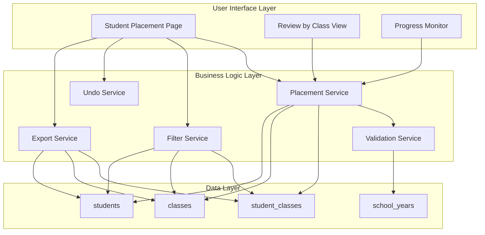

# Design Document: Student Placement

## Overview

The Student Placement feature provides a comprehensive interface for school administrators to manage the annual process of promoting and assigning students to new classes. The system supports bulk operations for efficiency while allowing individual adjustments for exceptions. It maintains data integrity by creating new enrollment records without modifying historical data.

### Key Design Goals
- **Efficiency**: Handle hundreds of students with bulk operations
- **Flexibility**: Support exceptions (repeaters, transfers, section changes)
- **Data Integrity**: Preserve historical enrollment records
- **Safety**: Undo capability and lock mechanism to prevent accidents
- **Visibility**: Progress tracking and review capabilities

## Architecture



## Components and Interfaces

### 1. Placement Service (`includes/placement.php`)

Core business logic for student placement operations.

```php
/**
 * Get eligible students from source school year
 * Returns students enrolled in source year but not yet placed in target year
 */
function getEligibleStudents(int $sourceSchoolYearId, int $targetSchoolYearId): array

/**
 * Get suggested grade promotion for a student
 * Returns next grade level based on current enrollment
 */
function getSuggestedGrade(string $currentGrade): string

/**
 * Bulk assign students to a target class
 * Returns array with success/failed counts and details
 */
function bulkAssignStudents(array $studentIds, int $targetClassId, int $enrolledBy): array

/**
 * Assign single student to a class (for individual adjustments)
 */
function assignStudentPlacement(int $studentId, int $targetClassId, int $enrolledBy): bool

/**
 * Remove student from pending placement (before save)
 */
function removePendingPlacement(int $studentId, int $targetClassId): bool

/**
 * Save all pending placements to database
 * Uses transaction for atomicity
 */
function savePlacements(array $placements, int $enrolledBy): array

/**
 * Get placement statistics for progress tracking
 */
function getPlacementStats(int $sourceSchoolYearId, int $targetSchoolYearId): array

/**
 * Check if school year enrollment is locked
 */
function isEnrollmentLocked(int $schoolYearId): bool

/**
 * Lock school year enrollment
 */
function lockEnrollment(int $schoolYearId): bool
```

### 2. Filter Service (integrated in placement.php)

```php
/**
 * Filter students by grade level and/or section
 */
function filterStudents(array $students, ?string $gradeLevel, ?string $section): array

/**
 * Get available filter options from student list
 */
function getFilterOptions(array $students): array
```

### 3. Undo Service (session-based)

```php
/**
 * Push action to undo stack
 */
function pushUndoAction(array $action): void

/**
 * Pop and reverse last action
 */
function popUndoAction(): ?array

/**
 * Clear undo stack (after save)
 */
function clearUndoStack(): void

/**
 * Get undo stack size
 */
function getUndoStackSize(): int
```

### 4. Export Service

```php
/**
 * Generate CSV export of placement preview
 */
function exportPlacementPreview(int $sourceSchoolYearId, int $targetSchoolYearId): string
```

### 5. Validation Service

```php
/**
 * Validate placement operation
 * Checks: same year, locked status, class exists, capacity
 */
function validatePlacement(int $studentId, int $targetClassId): array

/**
 * Check class capacity
 */
function checkClassCapacity(int $classId, int $additionalStudents = 1): array
```

## Data Models

### Session-Based Placement State

During the placement process, pending assignments are stored in session before final save:

```php
$_SESSION['placement'] = [
    'source_school_year_id' => 1,
    'target_school_year_id' => 2,
    'assignments' => [
        // student_id => target_class_id
        9 => 5,
        10 => 5,
        11 => 6,
    ],
    'undo_stack' => [
        [
            'type' => 'bulk_assign',
            'student_ids' => [9, 10],
            'target_class_id' => 5,
            'timestamp' => '2025-12-19 10:30:00'
        ]
    ]
];
```

### Database Schema Addition

Add `is_locked` column to `school_years` table:

```sql
ALTER TABLE school_years 
ADD COLUMN is_locked TINYINT(1) DEFAULT 0 
COMMENT 'Prevents enrollment changes when locked';
```

Optional: Add `max_capacity` to `classes` table:

```sql
ALTER TABLE classes 
ADD COLUMN max_capacity INT DEFAULT 50 
COMMENT 'Maximum students allowed in class';
```

### Placement Result Structure

```php
$placementResult = [
    'success' => true,
    'created_count' => 45,
    'skipped_count' => 3,
    'skipped' => [
        ['student_id' => 12, 'reason' => 'Already enrolled in target year'],
        ['student_id' => 15, 'reason' => 'Student inactive'],
    ],
    'enrollments' => [
        ['student_id' => 9, 'class_id' => 5, 'enrollment_id' => 100],
        // ...
    ]
];
```

## Correctness Properties

*A property is a characteristic or behavior that should hold true across all valid executions of a system-essentially, a formal statement about what the system should do. Properties serve as the bridge between human-readable specifications and machine-verifiable correctness guarantees.*

### Property 1: Eligible Students Retrieval
*For any* source school year with enrolled students and any target school year, the eligible students list SHALL contain only students who are:
- Enrolled in the source school year (active enrollment)
- NOT already enrolled in any class for the target school year
- Have active student status

**Validates: Requirements 1.2**

### Property 2: Filter Correctness
*For any* list of students and any grade level or section filter, the filtered result SHALL contain only students whose enrollment matches the specified filter criteria, and the count SHALL equal the length of the filtered list.

**Validates: Requirements 2.2, 2.3, 2.4**

### Property 3: Bulk Assignment Integrity
*For any* set of selected students and target class, after bulk assignment:
- All students without conflicts SHALL be assigned to the target class
- Students already enrolled in target school year SHALL be skipped and reported
- The success count plus skipped count SHALL equal the total selected students

**Validates: Requirements 3.2, 3.3, 3.4**

### Property 4: Source Data Preservation
*For any* placement operation (bulk or individual), the enrollment records in the source school year SHALL remain unchanged after the operation completes.

**Validates: Requirements 3.5, 8.4**

### Property 5: Grade Suggestion Calculation
*For any* student enrolled in "Grade N", the suggested target grade SHALL be "Grade N+1", and the display format SHALL be "Grade N → Grade N+1".

**Validates: Requirements 5.1, 5.2**

### Property 6: Class Review Data Completeness
*For any* target class with assigned students, the review view SHALL display all assigned students with their source class information, and the displayed count SHALL match the actual number of students assigned.

**Validates: Requirements 6.2, 6.3**

### Property 7: Progress Statistics Consistency
*For any* placement session, the sum of (placed + pending + conflicts) SHALL equal the total eligible students, and the progress indicator SHALL accurately reflect the placed count.

**Validates: Requirements 7.1, 7.2, 7.4**

### Property 8: Transaction Atomicity
*For any* save operation, either ALL placements succeed and enrollment records are created, OR the transaction rolls back and NO records are created. Partial saves SHALL NOT occur.

**Validates: Requirements 8.1, 8.2, 8.3**

### Property 9: Lock Enforcement
*For any* locked school year, ALL placement operations (new assignments, removals, modifications) SHALL be rejected with appropriate error messages.

**Validates: Requirements 9.3, 9.4**

### Property 10: Undo Stack LIFO Behavior
*For any* sequence of bulk actions, undoing SHALL reverse actions in Last-In-First-Out order, and after undo, the affected students SHALL return to their previous unassigned state.

**Validates: Requirements 10.2, 10.3, 10.4**

### Property 11: Export Content Completeness
*For any* export operation, the generated CSV SHALL contain columns for student name, LRN, source class, target class, and status for every student in the placement session, with filename containing timestamp and school year.

**Validates: Requirements 11.2, 11.3, 11.5**

### Property 12: Capacity Warning Accuracy
*For any* class with defined capacity, warnings SHALL be displayed when current enrollment reaches or exceeds the threshold, and bulk assignments SHALL warn before exceeding capacity.

**Validates: Requirements 12.1, 12.2, 12.3**

## Error Handling

### Validation Errors
- Same source/target school year → Display error, prevent action
- Target school year locked → Display "Enrollment Locked" status
- No classes in target year → Display warning, disable placement
- Student already enrolled → Skip and report in results

### Database Errors
- Transaction failure → Rollback all changes, display error message
- Connection error → Retry with exponential backoff, then fail gracefully

### Capacity Warnings
- Soft warning at 90% capacity
- Hard warning when exceeding capacity (requires acknowledgment)

## Testing Strategy

### Unit Testing
- Test individual functions in `includes/placement.php`
- Test filter logic with various combinations
- Test grade suggestion calculation
- Test validation rules

### Property-Based Testing
Using a PHP property-based testing library (e.g., `eris/eris` or `phpspec/prophecy`), we will implement property tests for each correctness property defined above.

**Configuration:**
- Minimum 100 iterations per property test
- Use generators for random student data, class data, and school year data

**Test File Location:** `tests/PlacementPropertyTest.php`

**Annotation Format:**
```php
/**
 * **Feature: student-placement, Property 1: Eligible Students Retrieval**
 * @test
 */
public function eligibleStudentsContainOnlyValidCandidates(): void
```

### Integration Testing
- Test full placement workflow from selection to save
- Test undo/redo across multiple operations
- Test export generation with real data
- Test lock mechanism prevents all modifications

### Edge Cases
- Empty source school year (no students)
- All students already placed
- Single student placement
- Maximum capacity exactly reached
- Undo when stack is empty
